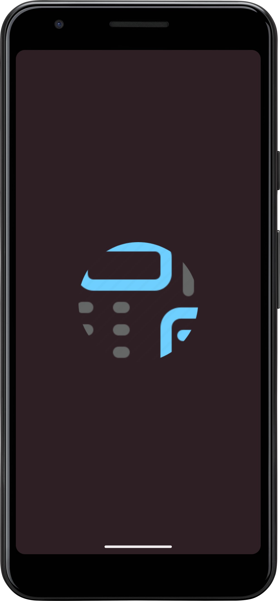

# calculator-ui-design
The project is the implementation of UI design for scientific calculator in dribble using android studio code. 

A simple calculator app with basic and scientific functionality. This app provides a user-friendly interface for performing various arithmetic and scientific calculations.

## Features

- **Basic Calculator:** Perform standard arithmetic operations like addition, subtraction, multiplication, and division.

- **Scientific Calculator:** Access advanced functions such as trigonometric functions, exponentiation, square roots, etc.

- **Splash Screen:** A welcoming splash screen to enhance the user experience while the app initializes.

## Design Inspiration

The design for this app was inspired by the creativity and innovation found on Dribbble. The UI elements, color scheme, and overall aesthetic draw from the following sources:

- [Dribbble Inspiration 1](https://dribbble.com/shots/17058307-Calculator-04?utm_source=Clipboard_Shot&utm_campaign=Praju10604&utm_content=Calculator%20%2304&utm_medium=Social_Share&utm_source=Clipboard_Shot&utm_campaign=Praju10604&utm_content=Calculator%20%2304&utm_medium=Social_Share)
# Screenshots

Here are some screenshots of the app's UI:

## Getting Started

As of now, the codebase for the Java/Kotlin parts of the app is not yet implemented. You've focused on creating the UI and gathering design inspiration. The code will be added soon to complete the app's functionality.

### Prerequisites

- Android Studio: [Download Android Studio](https://developer.android.com/studio)

## Contributing

Contributions are welcome! Once you've added the Java/Kotlin codebase, if you find any issues or would like to add new features, please submit a pull request.
